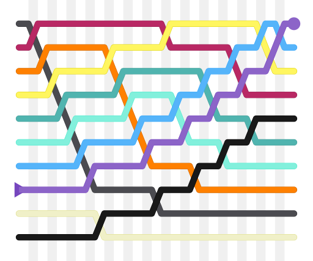

## Sort


### 1. 快速排序

> 快速排序（Quicksort）是对[冒泡排序](https://baike.baidu.com/item/冒泡排序/4602306)的一种改进。
>
> 快速排序由C. A. R. Hoare在1960年提出。它的基本思想是：通过一趟排序将要排序的数据分割成独立的两部分，其中一部分的所有数据都比另外一部分的所有数据都要小，然后再按此方法对这两部分数据分别进行快速排序，整个排序过程可以[递归](https://baike.baidu.com/item/递归/1740695)进行，以此达到整个数据变成有序[序列](https://baike.baidu.com/item/序列/1302588)。


| 最坏时间复杂度     | $\theta(n^2)$                |
| ------------------ | ---------------------------- |
| **最优时间复杂度** | $\theta(n \log n)$           |
| **平均时间复杂度** | $\theta(n \log n)$           |
| **最坏空间复杂度** | **根据实现的方法不同而不同** |


> 快速排序使用[分治法](https://zh.wikipedia.org/wiki/分治法)（Divide and conquer）策略来把一个[序列](https://zh.wikipedia.org/wiki/序列)（list）分为较小和较大的2个子序列，然后递归地排序两个子序列。
>
> 步骤为：
>
> 1. 挑选基准值：从数列中挑出一个元素，称为“基准”（pivot），
> 2. 分割：重新排序数列，所有比基准值小的元素摆放在基准前面，所有比基准值大的元素摆在基准后面（与基准值相等的数可以到任何一边）。在这个分割结束之后，对基准值的排序就已经完成，
> 3. 递归排序子序列：[递归](https://zh.wikipedia.org/wiki/递归)地将小于基准值元素的子序列和大于基准值元素的子序列排序。
>
> 递归到最底部的判断条件是数列的大小是零或一，此时该数列显然已经有序。
>
> 选取基准值有数种具体方法，此选取方法对排序的时间性能有决定性影响。

#### c++递归版本

```cpp
template<typename T>
void quick_sort_recursive(T arr[], int left, int right){

    if (left >= right)
        return;

    int i = left, j = right;
    T key = arr[left];

    while (i < j){
        while (i < j && arr[j] > key)
            j--;
        arr[i] = arr[j];
        while (i < j && arr[i] <= key)
            i++;
        arr[j] = arr[i];
    }

    arr[i] = key;
    quick_sort(arr, left, i - 1);
    quick_sort(arr, i + 1, right);
}
```

#### c++迭代版本

```cpp
struct Range{
        int start, end;
        Range(int s = 0, int e = 0){
            start = s;
            end = e;
        }
    };

template <typename T>
void quick_sort(T arr[], const int len){
    if (len <= 0)
        return;

    Range r[len];

    int p = 0;
    r[p++] = Range(0, len - 1);
    while (p){
        Range range = r[--p];
        if (range.start >= range.end)
            continue;
        T key = arr[range.start];

        int left = range.start, right = range.end;
        while (left < right){
            while (arr[right] > key && right > left)
                right--;
            while (arr[left] <= key && right > left)
                left++;
            swap(arr[left], arr[right]);
        }
        if (arr[left] <= arr[range.start])
            swap(arr[left], arr[range.start]);
        else left--;
        r[p++] = Range(range.start, left - 1);
        r[p++] = Range(left + 1, range.end);
    }
}
```

### 2. 冒泡排序

> **冒泡排序**（英语：**Bubble Sort**）是一种简单的[排序算法](https://zh.wikipedia.org/wiki/排序算法)。它重复地走访过要排序的[数列](https://zh.wikipedia.org/wiki/数列)，一次比较两个元素，如果他们的顺序错误就把他们交换过来。走访数列的工作是重复地进行直到没有再需要交换，也就是说该数列已经排序完成。这个算法的名字由来是因为越小的元素会经由交换慢慢“浮”到数列的顶端


| 最坏时间复杂度     | $\theta(n^2)$                                  |
| ------------------ | ---------------------------------------------- |
| **最优时间复杂度** | $\theta(n)$                                    |
| **平均时间复杂度** | $\theta(n^2)$                                  |
| **最坏空间复杂度** | **总共**$\theta(n)$**需要辅助空间**$\theta(1)$ |

> 冒泡排序算法的运作如下：
>
> 1. 比较相邻的元素。如果第一个比第二个大，就交换他们两个。
> 2. 对每一对相邻元素作同样的工作，从开始第一对到结尾的最后一对。这步做完后，最后的元素会是最大的数。
> 3. 针对所有的元素重复以上的步骤，除了最后一个。
> 4. 持续每次对越来越少的元素重复上面的步骤，直到没有任何一对数字需要比较。



#### c++

```cpp
template <typename T>
void Bubble_sort(T arr[], int len){
    for (int i = 0; i < len - 1; i++){
        for (int j = 0; j < len - 1 - i; j++)
        {
            if (arr[j] > arr[j + 1])
                swap(arr[j], arr[j + 1]);

        }
    }
}
```

